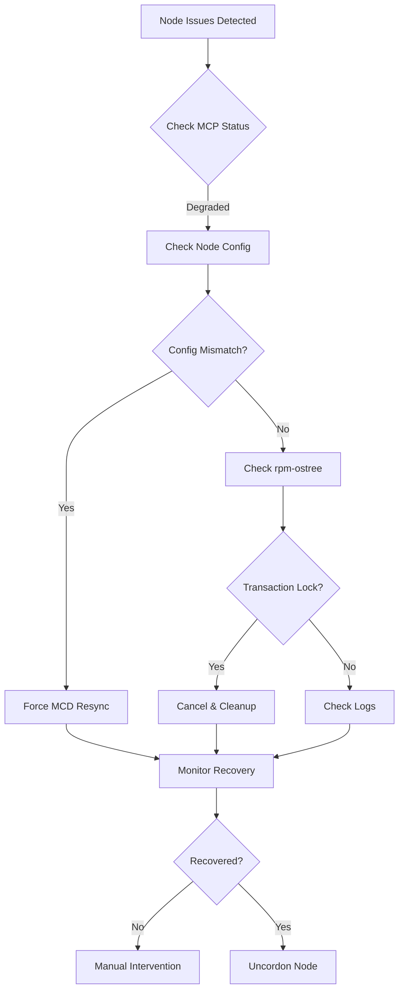

# OpenShift 4.18 Troubleshooting Guide

A comprehensive troubleshooting guide for OpenShift 4.18 clusters, covering cgroup migration, machine configuration issues, and common operational challenges.

## 📋 Overview

This repository contains a detailed troubleshooting guide for OpenShift Container Platform 4.18, based on real-world scenarios and best practices. The guide provides step-by-step procedures for diagnosing and resolving common issues encountered during cluster operations and upgrades.

## 🎯 What's Covered

### Core Topics
- **Cgroup Migration** - v1 to v2 transition guidance
- **Machine Config Pool Management** - Handling degraded states and sync failures
- **Node Configuration** - Synchronization and validation procedures
- **rpm-ostree Operations** - Transaction management and troubleshooting
- **Certificate Management** - Secret extraction and certificate validation
- **CoreDNS Issues** - Configuration validation and debugging

### Key Features
- ✅ Generic, reusable commands (no cluster-specific details)
- ✅ Step-by-step troubleshooting procedures
- ✅ Real-time monitoring scripts
- ✅ Quick reference command tables
- ✅ Common error messages with solutions
- ✅ Advanced diagnostics and must-gather procedures

## 📖 Document Structure

1. **Overview** - Understanding OpenShift 4.18 and cgroup support
2. **Prerequisites** - Required access and important considerations
3. **Common Issues** - Symptoms and identification
4. **Troubleshooting Procedures** - Step-by-step resolution guides
5. **Node Configuration Management** - Manual intervention procedures
6. **Monitoring and Verification** - Real-time tracking and validation
7. **Certificate Management** - Secret and certificate operations
8. **Advanced Troubleshooting** - Deep diagnostics and must-gather
9. **Reference Commands** - Quick lookup table

## 🚀 Quick Start

### Prerequisites

- SSH access to cluster nodes (master, worker, infra)
- OpenShift cluster-admin privileges
- Access to bastion/jump server

### Common Commands

```bash
# Check Machine Config Pool status
oc get mcp

# Check node status
oc get nodes -o wide

# Debug a node
oc debug node/<NODE_NAME>

# Check cluster operators
oc get co

# View kernel arguments (on node)
rpm-ostree kargs
```

## 🔧 Common Troubleshooting Scenarios

### Machine Config Pool Degraded

**Symptoms:**
- MCP shows DEGRADED=True
- Nodes failing to sync
- Error: "pool is degraded because nodes fail..."

**Quick Fix:**
```bash
# On the affected node
rm /etc/machine-config-daemon/currentconfig
touch /run/machine-config-daemon-force
systemctl restart kubelet
```

### rpm-ostree Transaction Lock

**Symptoms:**
- Error: "Transaction in progress"
- Node unable to complete operations

**Quick Fix:**
```bash
rpm-ostree cancel
systemctl restart rpm-ostreed
rpm-ostree cleanup -r
```

### Node Configuration Mismatch

**Check Status:**
```bash
oc get nodes -ojson | jq -r '"Node | Current MC | Desired MC | MC State",(.items| sort_by(.metadata.name,.metadata.annotations."machineconfiguration.openshift.io/desiredConfig",.metadata.annotations."machineconfiguration.openshift.io/currentConfig") | .[]  | "\(.metadata.name) | \(.metadata.annotations."machineconfiguration.openshift.io/currentConfig") | \(.metadata.annotations."machineconfiguration.openshift.io/desiredConfig") | \(.metadata.annotations."machineconfiguration.openshift.io/state")")' | column -t -s'|'
```

## 📊 Monitoring

### Real-time Cluster Monitoring

```bash
watch -n 1 "oc get clusterversion; echo; echo; \
             oc get mcp; echo; echo; \
             oc get nodes; echo; echo; \
             echo '=== Last 15 logs from machine-config-controller ==='; \
             oc logs -l k8s-app=machine-config-controller -c machine-config-controller -n openshift-machine-config-operator --tail=15; echo; echo"
```

## 🔐 Certificate Management

### List All TLS Certificates with Expiry

```bash
echo -e "NAMESPACE\tNAME\tEXPIRY" && oc get secrets -A -o go-template='{{range .items}}{{if eq .type "kubernetes.io/tls"}}{{.metadata.namespace}}{{" "}}{{.metadata.name}}{{" "}}{{index .data "tls.crt"}}{{"\n"}}{{end}}{{end}}' | while read namespace name cert; do echo -en "$namespace\t$name\t"; echo $cert | base64 -d | openssl x509 -noout -issuer; done | column -t
```

### Extract and View Certificate

```bash
# Extract certificate
oc extract secret/<SECRET_NAME> --to=- --keys=tls.crt | openssl x509 -noout -text

# Check certificate expiry
oc extract secret/<SECRET_NAME> --to=- --keys=tls.crt | openssl x509 -noout -dates
```

## 🛠️ Advanced Operations

### Cgroup Configuration

**Apply cgroup v1 (Legacy):**
```bash
rpm-ostree kargs --append-if-missing=systemd.unified_cgroup_hierarchy=0 --append-if-missing=systemd.legacy_systemd_cgroup_controller=1
systemctl reboot
```

**Apply cgroup v2:**
```bash
rpm-ostree kargs --delete=systemd.unified_cgroup_hierarchy=0 --delete=systemd.legacy_systemd_cgroup_controller=1 --append=systemd.unified_cgroup_hierarchy=1 --append=cgroup_no_v1="all" --append=psi=0
touch /run/machine-config-daemon-force
systemctl reboot
```

### Node Drain and Recovery

```bash
# Set max unavailable
MAXUNAVAILABLE=1 && oc patch mcp worker -p "{\"spec\":{\"maxUnavailable\":${MAXUNAVAILABLE}}}" --type merge

# Drain node
oc adm drain <NODE_NAME> --ignore-daemonsets --delete-emptydir-data --force --disable-eviction

# After maintenance
oc adm uncordon <NODE_NAME>
```

## 📚 Additional Resources

### Red Hat Documentation
- [Machine Config Operator Issues](https://access.redhat.com/solutions/5500131)
- [OpenShift 4.18 Documentation](https://docs.openshift.com/)

### Must-Gather

```bash
# Collect diagnostics
oc adm must-gather

# Compress output
tar -czvf must-gather-$(date +%Y%m%d-%H%M%S).tar.gz must-gather.local.*
```

### Node-Level Diagnostics

```bash
# On the node
sosreport -e podman -e crio -k crio.all=on -k crio.logs=on -k podman.all=on -k podman.logs=on --all-logs --plugin-timeout=600
```

## ⚠️ Important Notes

- **Cgroup Migration:** Migration to cgroup v2 is optional for OCP 4.18. Staying on cgroup v1 is fully supported.
- **Maintenance Windows:** Node operations require reboots and may impact workload availability. Plan accordingly.
- **Backup First:** Always capture must-gather before making changes.
- **Test in Non-Production:** Test all procedures in a non-production environment first.

## 🔄 Node Recovery Workflow



## 📝 Version History

- **v1.1** - Added certificate management, CoreDNS troubleshooting, and enhanced node debugging
- **v1.0** - Initial release with cgroup migration and MCP troubleshooting

## 🤝 Contributing

This guide is based on real-world troubleshooting scenarios. If you have additional procedures or improvements:

1. Ensure all cluster-specific information is removed
2. Use generic placeholders (e.g., `<NODE_NAME>`, `<HASH>`)
3. Test procedures in a lab environment
4. Document the issue, symptoms, and solution clearly

## 📄 License

This documentation is provided as-is for educational and operational purposes.

## 👥 Acknowledgments

This guide was compiled from real troubleshooting sessions and operational experience with OpenShift 4.18 clusters. Special thanks to the DevOps and platform engineering teams who contributed their knowledge and expertise.

---

**Document Version:** 1.1  
**Target Platform:** OpenShift Container Platform 4.18  
**Last Updated:** February 2026

## 🔗 Quick Links

| Task | Command |
|------|---------|
| Check MCP | `oc get mcp` |
| Check Nodes | `oc get nodes -o wide` |
| Debug Node | `oc debug node/<NODE_NAME>` |
| Check Operators | `oc get co` |
| View Kernel Args | `rpm-ostree kargs` |
| Force MCD Resync | `rm /etc/machine-config-daemon/currentconfig && touch /run/machine-config-daemon-force` |
| Cancel Transaction | `rpm-ostree cancel` |
| Drain Node | `oc adm drain <NODE> --ignore-daemonsets --delete-emptydir-data --force --disable-eviction` |
| Uncordon Node | `oc adm uncordon <NODE>` |
| Must-Gather | `oc adm must-gather` |

---

For detailed procedures and advanced troubleshooting, refer to the complete guide document: **OpenShift_4.18_Troubleshooting_Guide.docx**
